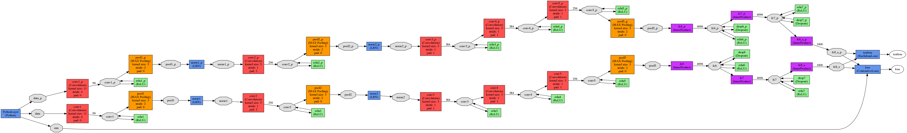

# scene-recognition-and-visualization
============

This project involves developing one-shot learning methods for indoor sub-scene classification.
Some network visualization techniques will also be implemented.

One-shot learning
----------

Aim is to recognise which floor the robot is currently at.

Methods implemented:

  1. Siamese Network:

    Uses contrastive loss
    ~~~
    python trainSiamese.py
    ~~~

    

  2. Modified Siamese network:

    Uses identification inaddition to contrastive loss
    ~~~
    python trainModifiedSiamese.py
    ~~~

    

trainSiamese.py or trainModifiedSiamese.py
----
To change the fc8 layer size, train, test and to visualize read the comments in the code

Visualization
---------------

Aim is to visualize what parts of the image are important for the classification.

Methods considered:

  1. Occulsion heat map
  2. ...
